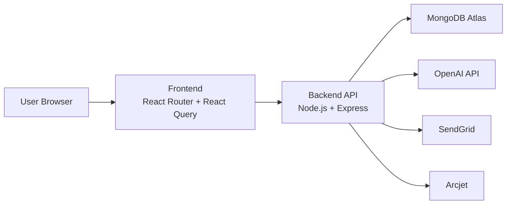

# Yutani Foundation Presentation Content

This file is written so you can copy directly into PowerPoint or Google Slides.

## Slide 1: Title

**Yutani Foundation**

Full-Stack Project Management System

- Developed using React, React Router, Node.js, Express, and MongoDB
- Designed to manage workspaces, projects, tasks, members, and analytics
- Includes AI assistant support and dark mode

Presenter details:

- Name: `Add your name`
- Course / Subject: `Add your course`
- Roll Number: `Add your roll number`
- Date: `Add presentation date`

## Slide 2: Problem Statement

Organizations often struggle to manage projects efficiently when work is spread across chats, spreadsheets, and manual follow-ups.

Main problems:

- No single place to track projects and tasks
- Poor visibility into team progress
- Difficulty assigning responsibilities
- Weak collaboration and update tracking
- Limited productivity insights for managers

## Slide 3: Proposed Solution

Yutani Foundation is a web-based project management platform that centralizes team collaboration.

The system allows users to:

- Create workspaces for teams
- Create projects inside workspaces
- Assign project members with roles
- Create and manage tasks
- Track task progress and priorities
- View dashboard analytics
- Use an AI assistant for guidance and planning

## Slide 4: Objectives

- Build a real-world full-stack application
- Provide secure authentication for users
- Support workspace-based collaboration
- Manage projects and tasks in a structured way
- Improve productivity using dashboards and AI assistance
- Offer a modern user experience with dark mode and responsive design

## Slide 5: Key Features

- User signup, login, and password reset
- Workspace creation and member invitation
- Project creation with project-level member roles
- Task management with status and priority
- Archived task view
- Dashboard analytics and recent project tracking
- Activity logging and comments
- AI chat assistant
- Dark mode toggle

## Slide 6: Technology Stack

Frontend:

- React 19
- React Router 7
- TypeScript
- Tailwind CSS
- React Query

Backend:

- Node.js
- Express.js
- MongoDB
- Mongoose
- JWT authentication

Integrations:

- OpenAI for AI assistant
- SendGrid for email delivery
- Arcjet for request protection

## Slide 7: System Architecture

Explanation:

- The frontend handles UI and user interaction
- The backend manages authentication, business logic, and APIs
- MongoDB stores users, workspaces, projects, tasks, and activity data
- OpenAI powers the in-app AI assistant
- SendGrid handles email flows
- Arcjet adds production security checks

## Slide 8: Database Design

Main collections used in the project:

- `User`
- `Workspace`
- `Project`
- `Task`
- `Comment`
- `Activity`
- `Verification`
- `WorkspaceInvite`

Important relationships:

- One workspace contains many projects
- One project contains many tasks
- One task contains comments and subtasks
- Users can belong to multiple workspaces and projects

## Slide 9: Authentication and Security

- Passwords are hashed using bcrypt
- JWT is used for session authentication
- Protected routes require valid tokens
- Workspace and project membership checks protect data access
- Arcjet can be enabled in production for rate limiting and bot protection

## Slide 10: Dashboard and Analytics

The dashboard provides management insights such as:

- Total projects
- Total tasks
- Tasks in progress
- Completed tasks
- To-do tasks
- Upcoming tasks
- Project status distribution
- Task priority breakdown

This helps managers quickly understand current team progress.

## Slide 11: AI Assistant

The system includes an AI assistant inside the dashboard.

It helps users:

- Understand the current page
- Plan projects and tasks
- Draft updates
- Improve productivity
- Get guidance without leaving the application

## Slide 12: Challenges Faced

- Dependency conflicts in frontend packages
- Runtime UI crashes caused by missing data
- MongoDB Atlas connection and authentication issues
- Backend startup and local environment issues
- CORS and port conflicts between frontend and backend

## Slide 13: Improvements Made

- Fixed package compatibility issues
- Improved project creation behavior
- Hardened auth and workspace flows
- Added archived and settings pages
- Added dark mode
- Added AI assistant
- Improved dashboard loading and caching
- Added deployment files and documentation

## Slide 14: Deployment Strategy

Recommended deployment:

- Frontend on Render Web Service
- Backend on Render Web Service
- Database on MongoDB Atlas

Production environment variables are documented in the project README and Render blueprint.

## Slide 15: Future Scope

- Real-time notifications
- File upload storage with cloud providers
- Team chat integration
- Calendar and meeting integration
- More detailed reporting and exports
- Better role-based permissions
- Automated test suite

## Slide 16: Conclusion

Yutani Foundation demonstrates a practical full-stack project management solution with:

- Secure authentication
- Team collaboration features
- Structured project and task tracking
- Productivity dashboards
- AI-assisted usability

It is suitable as a strong academic full-stack project and can be extended further for production use.

## Slide 17: Thank You

Thank you

Questions?
